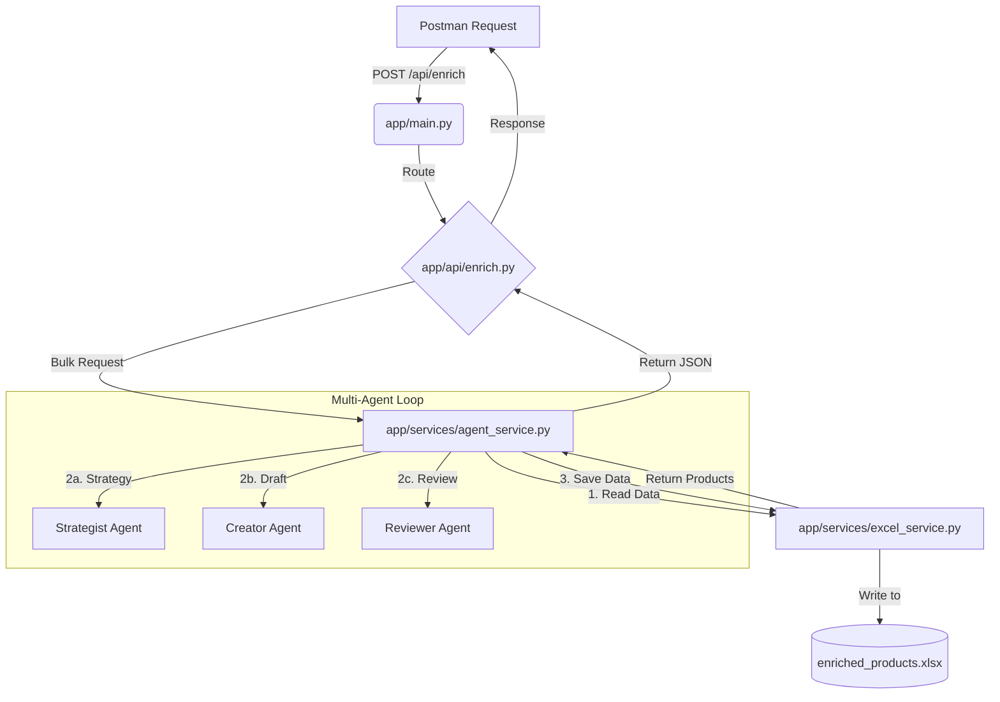

# System Execution Flow

This document outlines the step-by-step process that occurs when you send a **POST** request to the API.

## 1. Entry Point: `app/main.py`
The request first hits the FastAPI application entry point.
- **File**: `app/main.py`
- **Action**: Receives the HTTP request and routes it to the correct handler based on the URL (`/api/enrich/bulk` or `/api/enrich`).
- **Function**: `bulk_enrich_products` or `enrich_product`

## 2. API Layer: `app/api/enrich.py`
This file handles the request validation and response formatting.
- **File**: `app/api/enrich.py`
- **Action**: 
    1. Validates the input (checks if request body is valid using `app/models/schemas.py`).
    2. Calls the **AgentService** to perform the heavy lifting.
- **Code Reference**: 
    ```python
    await agent_service.process_bulk_enrichment(batch_size=10)
    # OR
    await agent_service.enrich_product_multi_agent(code, description)
    ```

## 3. Service Layer: `app/services/agent_service.py`
This is the "Brain" of the V3 architecture. It orchestrates the entire multi-agent process.
- **File**: `app/services/agent_service.py`
- **Action**:
    1. **Bulk Flow**: Calls `excel_service` to read the next batch of products.
    2. **Enrichment Loop**: For each product, it runs the **3-Stage Agent Process**:
        *   **Step 3a (Strategist)**: Calls GPT-4o with `STRATEGIST_PROMPT` (from `app/core/agent_prompts.py`).
        *   **Step 3b (Creator)**: Calls GPT-4o with `CREATOR_PROMPT`, passing the strategist's brief.
        *   **Step 3c (Reviewer)**: Calls GPT-4o with `REVIEWER_PROMPT`, validating the output into JSON.

## 4. Validating & Saving: `app/services/excel_service.py`
Once enrichment is complete, the data needs to be saved.
- **File**: `app/services/excel_service.py`
- **Action**:
    1. **Read**: `read_products_batch` reads raw data from `products.xlsx`.
    2. **Write**: `save_enrichment` appends the final valid JSON to `enriched_products.xlsx`.

## 5. Configuration: `app/core/config.py`
Throughout this process, the system reads environment variables (API Keys, file paths) from this file.
- **File**: `app/core/config.py`

---

## Visual Summary


