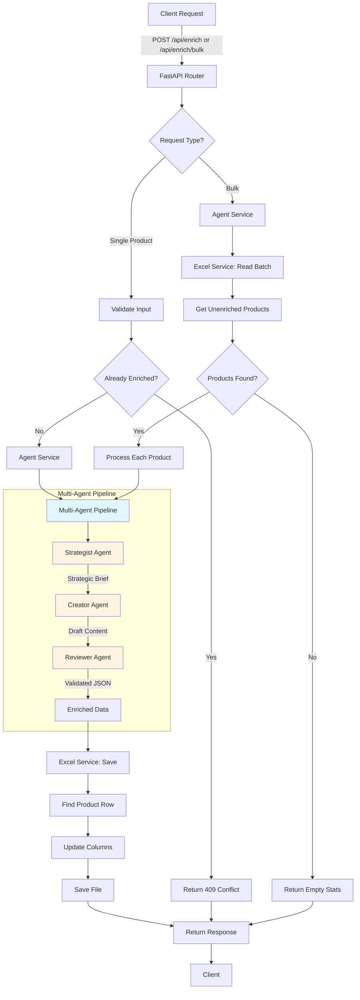

# Product Enrichment System - Process Flow

This document provides a comprehensive step-by-step guide to how the Product Enrichment system works.

## Overview

The Product Enrichment System uses a **Multi-Agent AI Architecture** to automatically generate rich product descriptions from basic product information. It processes products in batches, prevents duplicates, and stores enriched data directly in the source Excel file.

---

## System Architecture

### Key Components

1. **FastAPI Application** (`app/main.py`) - HTTP server and routing
2. **API Layer** (`app/api/enrich.py`) - Request validation and response handling
3. **Agent Service** (`app/services/agent_service.py`) - Multi-agent orchestration
4. **Excel Service** (`app/services/excel_service.py`) - File I/O and duplicate detection
5. **Configuration** (`app/core/config.py`) - Environment variables and settings
6. **Agent Prompts** (`app/core/agent_prompts.py`) - AI prompt templates

---

## Step-by-Step Process Flow

### 1. API Request Received

**Entry Point**: `app/main.py`

When you send a request to the API:
- **Single Product**: `POST /api/enrich` with `{"product_code": "ABC123", "product_description": "..."}`
- **Bulk Processing**: `POST /api/enrich/bulk` (no body required)

The FastAPI application routes the request to the appropriate handler in `app/api/enrich.py`.

---

### 2. Request Validation

**Handler**: `app/api/enrich.py`

#### For Single Product Enrichment:
1. Validates that `product_code` and `product_description` are not empty
2. Calls `excel_service.get_existing_product_codes()` to check for duplicates
3. If product is already enriched → Returns `409 Conflict`
4. If not enriched → Proceeds to enrichment

#### For Bulk Enrichment:
1. No validation needed (reads from file)
2. Proceeds directly to agent service

---

### 3. Reading Products from Excel

**Service**: `app/services/excel_service.py`

For bulk enrichment, the system:
1. Opens `app/data/products.xlsx`
2. Scans for products that **do not** have a value in the "Short Title" column
3. Returns the next batch (default: 10 products)

**Duplicate Detection Logic**:
- If "Short Title" column is populated → Product is considered enriched
- If "Short Title" column is empty → Product needs enrichment

---

### 4. Multi-Agent Enrichment Process

**Service**: `app/services/agent_service.py`

For each product, the system runs a **3-stage AI pipeline**:

#### Stage 1: Strategist Agent
- **Purpose**: Analyze the product and create a strategic brief
- **Prompt**: `STRATEGIST_PROMPT` from `app/core/agent_prompts.py`
- **Input**: Product code + description
- **Output**: Strategic brief with key selling points, target audience, tone

#### Stage 2: Creator Agent
- **Purpose**: Draft the actual product content
- **Prompt**: `CREATOR_PROMPT`
- **Input**: Strategic brief + product info
- **Output**: Draft short title, short description, long description

#### Stage 3: Reviewer Agent
- **Purpose**: Validate and format the output
- **Prompt**: `REVIEWER_PROMPT`
- **Input**: Draft content + product code
- **Output**: Final JSON with validated fields
- **Format**:
  ```json
  {
    "product_code": "ABC123",
    "short_title": "...",
    "short_description": "...",
    "long_description": "..."
  }
  ```

---

### 5. Saving Enriched Data

**Service**: `app/services/excel_service.py`

#### Process:
1. Opens `app/data/products.xlsx`
2. Ensures enrichment columns exist (adds them if missing):
   - Short Title
   - Short Description
   - Long Description
   - Timestamp
3. Finds the row matching the product code
4. Updates the row with enriched data
5. Saves the file

**Important**: The system writes to the **same file** it reads from, not a separate output file.

---

### 6. Response to Client

**Handler**: `app/api/enrich.py`

#### Single Product Response:
```json
{
  "product_code": "ABC123",
  "short_title": "Premium Widget",
  "short_description": "High-quality widget for...",
  "long_description": "Detailed description..."
}
```

#### Bulk Processing Response:
```json
{
  "processed": 10,
  "succeeded": 10,
  "failed": 0,
  "skipped": 0,
  "errors": []
}
```

---

## Flow Diagram



---

## Duplicate Prevention

The system prevents duplicate enrichment through:

1. **Column-Based Detection**: Checks if "Short Title" is populated
2. **In-Memory Tracking**: During batch processing, tracks enriched codes
3. **API-Level Blocking**: Returns 409 Conflict for already-enriched products

---

## Configuration

All settings are managed through environment variables in `.env`:

- `AZURE_OPENAI_ENDPOINT` - Azure OpenAI endpoint URL
- `AZURE_OPENAI_API_KEY` - API authentication key
- `ENRICHER_DEPLOYMENT` - Model deployment name (e.g., "gpt-4o")
- `OPENAI_TEMPERATURE` - AI creativity level (0.0-1.0)

---

## File Structure

```
Product_Enrichment-V3/
├── app/
│   ├── main.py                 # FastAPI application
│   ├── api/
│   │   └── enrich.py          # API endpoints
│   ├── services/
│   │   ├── agent_service.py   # Multi-agent orchestration
│   │   └── excel_service.py   # Excel file operations
│   ├── core/
│   │   ├── config.py          # Configuration
│   │   └── agent_prompts.py   # AI prompts
│   ├── models/
│   │   └── schemas.py         # Request/response models
│   └── data/
│       └── products.xlsx      # Source and output file
├── .env                        # Environment variables
├── requirements.txt            # Python dependencies
└── test_agent.py              # Test script
```

---

## Usage Examples

### Start the Server
```bash
uvicorn app.main:app --reload --port 8001
```

### Enrich a Single Product
```bash
curl -X POST http://localhost:8001/api/enrich \
  -H "Content-Type: application/json" \
  -d '{
    "product_code": "ABC123",
    "product_description": "Basic product info"
  }'
```

### Bulk Enrich (Next 10 Products)
```bash
curl -X POST http://localhost:8001/api/enrich/bulk
```

### Run Test Script
```bash
python test_agent.py
```

---

## Error Handling

| Status Code | Meaning | Cause |
|-------------|---------|-------|
| 200 | Success | Product enriched successfully |
| 400 | Bad Request | Missing or invalid input |
| 409 | Conflict | Product already enriched |
| 500 | Server Error | AI service failure or file I/O error |
